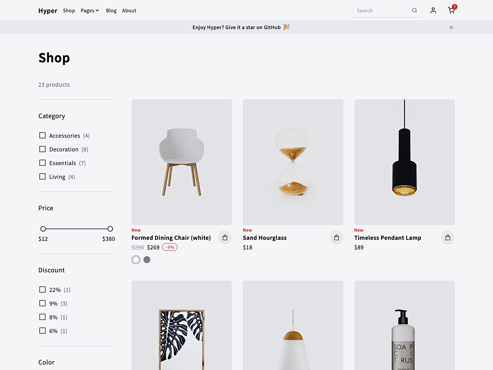

# Hyper

Starter template for marketing and eCommerce websites. Powered by [Alpine.js](https://alpinejs.dev/) and [HyperUI](https://www.hyperui.dev/).

### Quickstart

- [click here](https://github.com/new?template_name=Hyper&template_owner=rayc2045) to use this template, or clone this repo locally: `git clone https://github.com/rayc2045/Hyper`
- download [Live Server](https://www.npmjs.com/package/live-server) and run `live-server`

### Deploy

- [Netlify](https://hyper-template.netlify.app/)
- [GitHub Pages](https://rayc2045.github.io/Hyper/)
